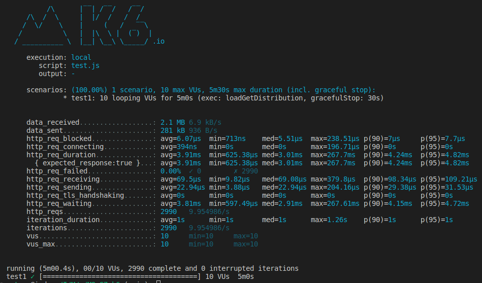

# Relatório de Teste de Carga com K6

## Introdução
Este relatório apresenta o processo e os resultados da atividade de teste de carga usando o k6. O k6 é uma ferramenta de teste de carga, que permite simular diversos usuários utilizando um endpoint de um API simultaneamente durante um período de tempo pré determinado.

## Conceitos do K6

- **Realização de testes**: Com essa atividade entendemos a importância da realização de testes de carga em uma API em busca de possíveis erros que podem ser arrumados antes da publicação da API.


## Configuração do Teste de Carga

Configuramos um cenário único chamado `test1` que roda durante 5 minutos, simulando 10 usuários virtuais acessando continuamente nosso endpoint `/distributions`.

```javascript
import http from 'k6/http';
import { sleep } from 'k6';

export const options = {
  scenarios: {
    test1:{
      executor: 'constant-vus',
      vus: 10,
      duration: '5m',
      exec: 'loadGetDistribution'
    },
  }
};

export function loadGetDistribution() {
  http.get('http://127.0.0.1:8080/distributions');
  sleep(1);
}
```
## Resultados do Teste de Carga

Podemos observar que todas as requisições foram bem sucedidas e que o tempo médio de cada requisição foi de 3.9 ms.

